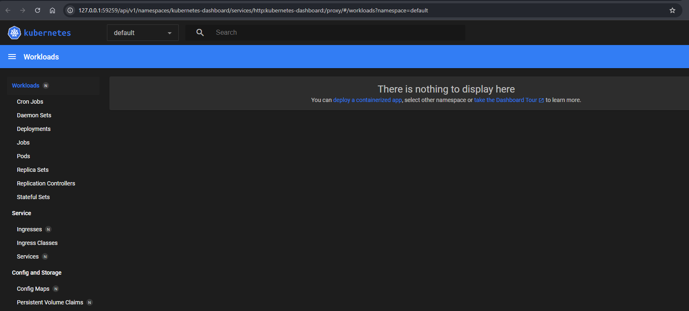
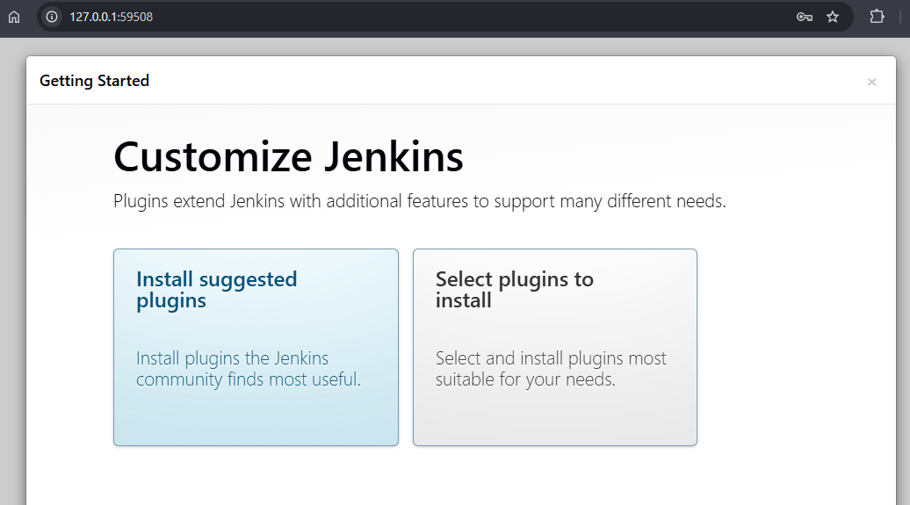
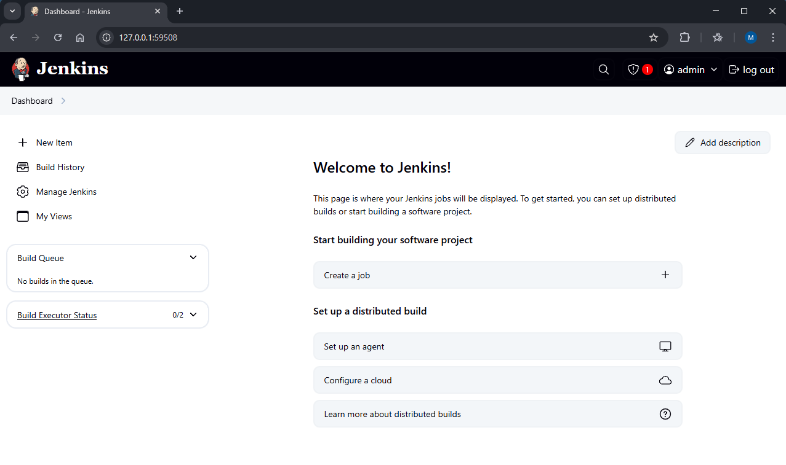

# poc-devops

# Build a deployment system with:
---

## 1. Jenkins  
Jenkins is an open-source automation server used to build, test, and deploy software continuously (CI/CD). It supports many plugins and integrates well with most development tools.  
🌐 [https://www.jenkins.io](https://www.jenkins.io)

---

## 2. Helm  
Helm is a package manager for Kubernetes that simplifies the deployment and management of applications using "charts." It helps you version, configure, and install applications in clusters.  
🌐 [https://helm.sh](https://helm.sh)

---

## 3. OpenTofu  
OpenTofu is an open-source infrastructure as code (IaC) tool for provisioning and managing cloud resources, fully compatible with Terraform.  
🌐 [https://opentofu.org](https://opentofu.org)

---

## 4. Minikube (or alternative)  
Minikube lets you run a local Kubernetes cluster on your machine, great for development and testing. Alternatives include **Kind** and **k3s** for lightweight or production-like setups.  
🌐 [https://minikube.sigs.k8s.io](https://minikube.sigs.k8s.io)

---

## 5. Prometheus  
Prometheus is an open-source monitoring system and time-series database designed for reliability and scalability, especially in cloud-native environments.  
🌐 [https://prometheus.io](https://prometheus.io)

---

## 6. Grafana  
Grafana is an open-source platform for visualizing time-series data, often used with Prometheus to create dashboards and alerts.  
🌐 [https://grafana.com](https://grafana.com)


* Requirements: You need to be able to deploy an application with all this tools and you need 2 clusters (or 2 namespaces) one for the infra and other for the apps that will be deployed. The pipelines in Jenkins need to run tests and fail if tests fail. OpenTofu need to have automated tests as well, all apps deployed need to be integrated with Grafana and Prometheus by default.


## Project Structure
project-root/
├── manifests/
│   ├── namespaces.yaml          # defines 'infra' and 'apps' namespaces
│   ├── jenkins/                 # all Jenkins-related k8s files
│   │   ├── jenkins-deployment.yaml
│   │   └── jenkins-service.yaml
│   ├── monitoring/              # prometheus, grafana deployments
│   └── other-resources.yaml
├── helm/
│   └── my-app/                  # your app's Helm chart
├── tofu/                        # OpenTofu (Terraform-compatible) files
│   ├── main.tf
│   └── ...
├── scripts/
│   └── deploy.sh                # helper scripts
├── Jenkinsfile


## How to Run It
1. Save the script as init-devops-structure.sh
2. Run it from your terminal:
```bash
chmod +x init-devops-structure.sh
./init-devops-structure.sh
```

---
### Installing Docker
https://docs.docker.com/get-docker/

### Installing Minikube
#### Step 1
- Download and run the installer for the latest release.
- Or if using PowerShell, use this command:
```bash
New-Item -Path 'c:\' -Name 'minikube' -ItemType Directory -Force
$ProgressPreference = 'SilentlyContinue'; Invoke-WebRequest -OutFile 'c:\minikube\minikube.exe' -Uri 'https://github.com/kubernetes/minikube/releases/latest/download/minikube-windows-amd64.exe' -UseBasicParsing
```
#### Step 2
- Add the minikube.exe binary to your PATH.
- Make sure to run PowerShell as Administrator.
```bash
$oldPath = [Environment]::GetEnvironmentVariable('Path', [EnvironmentVariableTarget]::Machine)
if ($oldPath.Split(';') -inotcontains 'C:\minikube'){
  [Environment]::SetEnvironmentVariable('Path', $('{0};C:\minikube' -f $oldPath), [EnvironmentVariableTarget]::Machine)
}
```

### Start up
#### Start Minikube with Docker
``` bash
minikube start --driver=docker
```
#### Enable the Kubernetes Dashboard (optional)
``` bash
minikube dashboard
```

http://127.0.0.1:59259/api/v1/namespaces/kubernetes-dashboard/services/http:kubernetes-dashboard:/proxy/#/workloads?namespace=default



---

### Deploy Jenkins to Kubernetes

#### Creating YAML to deploy Jenkins (apply it)
``` bash
kubectl apply -f manifests/jenkins/jenkins-deployment.yaml --namespace infra
```

#### Access Jenkins
``` bash
minikube service jenkins-service
```

#### Get Admin password
``` bash
kubectl exec -it $(kubectl get pod -l app=jenkins -o jsonpath="{.items[0].metadata.name}") -- cat /var/jenkins_home/secrets/initialAdminPassword
```

#### After applying the admin password



#### After adding some default plugins
